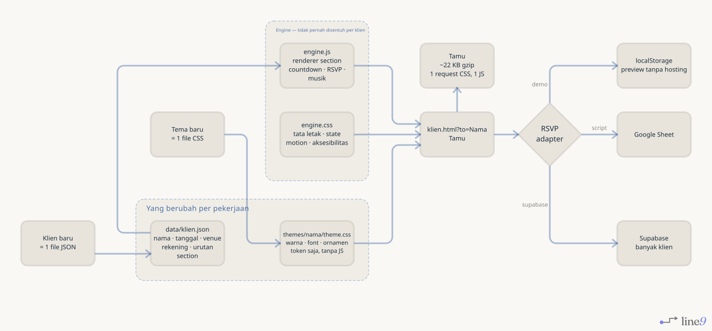

# undangan

Engine undangan pernikahan digital yang digerakkan data. Satu file JSON per
klien, satu folder CSS per tema, tanpa build step.

Dibuat karena bagian mahal dari bisnis undangan digital bukan mendesain halaman
cantik sekali — tapi mengirim halaman cantik ke-200 tanpa mengulang pekerjaan.

## Jalankan

```bash
python3 -m http.server 8000
# buka http://localhost:8000/?to=Keluarga%20Besar%20Wijaya
```

Tanpa dependency, tanpa `npm install`, tanpa bundler. Yang di-deploy persis
yang ada di repo — bisa ditaruh di GitHub Pages, Netlify, Cloudflare Pages,
atau shared hosting mana pun.

## Bikin undangan untuk klien baru

```bash
./bin/new-client.sh andi-sari forest-lace
$EDITOR data/andi-sari.json      # isi nama, tanggal, venue, rekening
```

Menghasilkan `andi-sari.html` + `data/andi-sari.json`. Bagikan sebagai
`https://…/andi-sari.html?to=Nama%20Tamu`.

## Kirim sebagai satu file

```bash
./bin/build-single.py data/andi-sari.json -o dist/andi-sari.html
```

Satu file ~64 KB berisi engine, tema, dan data sekaligus. Bisa di-email ke
klien, dibuka dari flashdisk, atau ditaruh di hosting mana pun tanpa struktur
folder. Ini juga yang diserahkan kalau klien mau menyimpan undangannya setelah
acara selesai.

Tambahkan `--inline-media` untuk menanam musik dan foto sebagai data URI —
benar-benar satu file tanpa referensi eksternal, tapi ukurannya melonjak ke
~1 MB. Untuk disebar ke tamu pakai versi hosted; lihat
[docs/DEPLOY.md](docs/DEPLOY.md).

## Musik

```json
{ "music": { "src": "assets/music/forest-lace.mp3", "volume": 0.55 } }
```

Default temanya adalah piano orisinal yang di-*generate* dari kode:

```bash
./bin/make-music.py -o assets/music/forest-lace.mp3
```

Disintesis di `bin/make-music.py`, bukan diambil dari mana-mana, supaya audio
yang ikut terjual bersama template jelas statusnya — tidak ada lisensi yang
perlu diurus. Untuk lagu pilihan pasangan, ganti `music.src` dengan file yang
mereka punya haknya. Jangan bundel lagu komersial ke dalam template yang dijual
berulang: itu distribusi ulang, dan vendor undangan digital termasuk yang kena.

## Arsitektur



<sub>Sumber: [`docs/architecture.mmd`](docs/architecture.mmd) — Mermaid, dirender dengan [line9](https://line9.ai): `line9 render docs/architecture.mmd --out docs/architecture.svg --theme linen`</sub>

## Struktur

```
engine/engine.js      renderer + perilaku — universal, tak pernah disentuh per klien
engine/engine.css     tata letak, spacing, state, motion, aksesibilitas
themes/<nama>/        warna, font, ornamen — CSS token saja
data/<klien>.json     isi undangan + urutan section
docs/THEMING.md       cara bikin tema baru
docs/SECTIONS.md      katalog section + skema data + backend RSVP
docs/DEPLOY.md        ke mana di-deploy, dan kenapa data klien tidak boleh publik
```

Kontrak yang bikin ini scalable: **tema tidak boleh menyentuh JavaScript, dan
data tidak boleh menyentuh CSS.** Tema baru = satu file CSS token. Klien baru =
satu file JSON. Kalau salah satu aturan itu dilanggar, biaya template ke-50
akan sama dengan template pertama — dan seluruh gunanya hilang.

## Yang sudah jalan

- Cover pengunci scroll, terbuka lewat tombol
- Nama tamu personal dari `?to=` — di-render aman lewat `textContent`, dengan
  fallback sopan untuk link generik
- Hitung mundur, sadar zona waktu acara (bukan zona waktu tamu)
- Strip hari-dalam-seminggu dengan tanggal acara ditandai
- Simpan ke Google Calendar
- Salin nomor rekening satu ketuk
- RSVP + dinding tamu, tiga backend: localStorage / Google Sheet / Supabase
- Musik latar, dimuat hanya saat tamu menekan putar — nol biaya di first paint
- Section kosong hilang sendiri; foto opsional di semua tempat

## Kenapa vanilla, kenapa SVG

Tamu membuka undangan ini di parkiran gedung dengan sinyal satu bar. Itu satu-
satunya kondisi pemakaian yang benar-benar penting, dan itu yang menentukan
hampir semua keputusan teknis di sini:

- **Tanpa framework.** Engine + tema ≈ 22 KB gzip, satu request CSS, satu JS.
- **Ornamen CSS/SVG, bukan PNG.** `forest-lace` tidak mengirim satu pun raster.
- **Tanpa build step.** Tak ada langkah yang bisa gagal antara repo dan produksi.

Banyak undangan digital di pasar mengirim 5–8 MB dan gagal di kondisi itu.
Kecepatan di sini bukan efek samping, itu argumen jualan yang bisa didemokan.

## Tema

| Tema | Karakter |
|---|---|
| `forest-lace` | hijau botani gelap, renda krem, emas antik, aksen magenta |

Bikin tema berikutnya: [docs/THEMING.md](docs/THEMING.md).

## Lisensi & aset

Kode engine bebas dipakai ulang. Setiap tema harus memakai aset yang kamu
punya haknya — jangan menyalin ornamen, foto, atau komposisi milik penjual
lain. Selain soal hukum, template yang identik dengan tetangga mengembalikanmu
ke perang harga, yang justru ingin dihindari repo ini.
